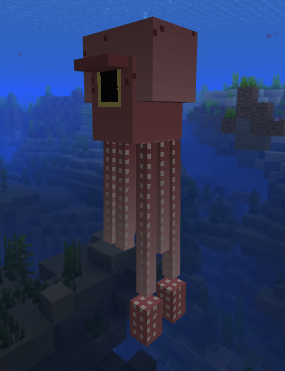
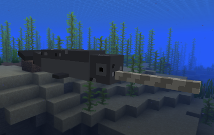

# Deep Blue - Ocean Megafauna Mod

A Minecraft Fabric mod that adds majestic ocean creatures to the game, bringing the deep blue seas to life.

## Screenshots

<p align="center">
  
  
</p>

## Features

### 10 New Ocean Creatures

| Creature | Biome | Special Features |
|----------|-------|------------------|
| **Humpback Whale** | Deep Ocean | Breaching animation, whale songs |
| **Blue Whale** | Deep Cold Ocean | Largest mob in the mod |
| **Orca** | Cold/Frozen Ocean | Pack hunting behavior |
| **Great White Shark** | Ocean/Deep Ocean | Aggressive predator |
| **Hammerhead Shark** | Warm/Lukewarm Ocean | Unique hammer-shaped head |
| **Whale Shark** | Warm Ocean | Rideable! |
| **Narwhal** | Frozen Ocean | Iconic spiral tusk |
| **Giant Squid** | Deep Ocean (rare) | Mini-boss, tentacle attacks |
| **Ocean Sunfish (Mola Mola)** | Temperate Ocean | Unique flat body shape |
| **Swordfish** | Warm Ocean | Fast swimmer with sword bill |

### Gameplay Features

- **Realistic Spawning**: Each creature spawns in appropriate ocean biomes
- **Unique Behaviors**: Pack hunting, breaching, riding mechanics
- **Loot Drops**: Fish, bones, rare items from each creature
- **GeckoLib Animations**: Smooth, realistic swimming animations

## Downloads

Pre-built releases are available in the `releases/` folder:

### Minecraft 1.21.1 (Recommended)
| Mod Loader | Download |
|------------|----------|
| **Fabric** | [deep-blue-fabric-1.21.1-1.0.0.jar](releases/1.21.1/deep-blue-fabric-1.21.1-1.0.0.jar) |
| **NeoForge** | [deep-blue-neoforge-1.21.1-1.0.0.jar](releases/1.21.1/deep-blue-neoforge-1.21.1-1.0.0.jar) |

## Installation

1. Install your preferred mod loader ([Fabric](https://fabricmc.net/) or [NeoForge](https://neoforged.net/))
2. Install [GeckoLib](https://modrinth.com/mod/geckolib) (required dependency)
3. For Fabric: Also install [Fabric API](https://modrinth.com/mod/fabric-api)
4. Download the appropriate Deep Blue jar from above and place in your `mods` folder

## Building from Source

```bash
./gradlew build
```

The built JAR will be in `build/libs/`

## Requirements

- Minecraft 1.20.1
- Fabric Loader 0.15.6+
- Fabric API 0.92.2+
- GeckoLib 4.4.7+

## Supported Versions

| Version | Fabric | NeoForge | Status |
|---------|--------|----------|--------|
| **1.21.1** | ✅ | ✅ | **Recommended** |
| 1.20.4 | ✅ | ✅ | Supported |
| 1.20.1 | ✅ | - | Supported |

## Credits

- **Developer**: Ege Kaanduman
- **Models & Textures**: Created with Blockbench
- **Animation System**: GeckoLib

## License

MIT License - Feel free to use, modify, and distribute.

---

*Part of the Minecraft Animal Modpacks project*
